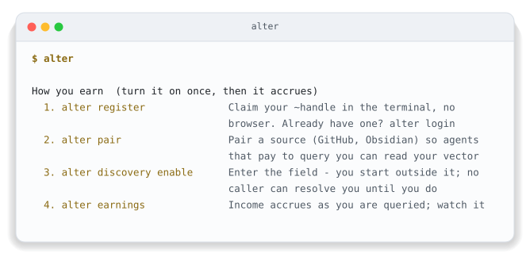
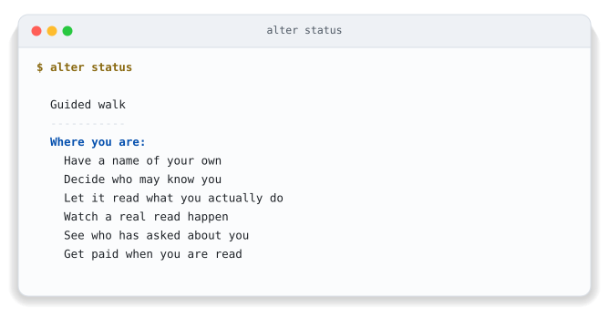
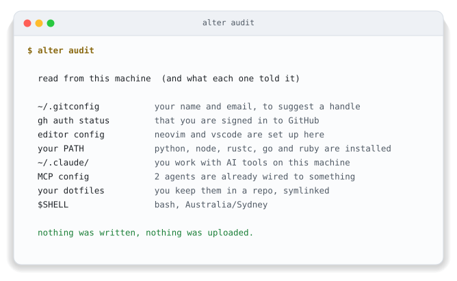
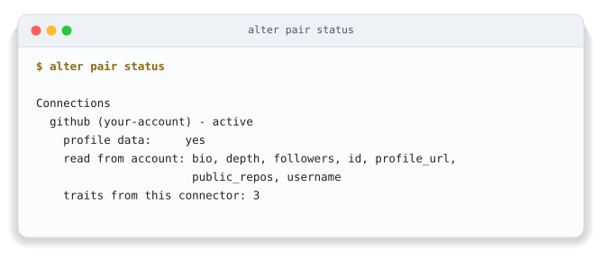

<div align="center">


# ~alter Homebrew Tap

**One command and you have a name that is yours.**

[](./Formula/alter.rb)
[](https://www.npmjs.com/package/@truealter/cli)
[](#install)
[](./LICENSE)

[What is ~alter?](#what-is-alter) · [Install](#install) · [The first five minutes](#the-first-five-minutes)

</div>

## What is ~alter?

You have run a brew install a hundred times without thinking about it, and this
one is the same shape. What is different is what it puts there. Every account
you already hold keeps its own version of you, assembled from what you told it
when you signed up, and none of those versions are yours to move or to take
back. When one of those companies closes, its version of you closes with it.

~Alter gives you a name no company issued and none can close. Your identity
does not fit on a CV, and a list of qualifications says what you were trained
to do rather than who you are.

Your identity is the line you have been drawing through the world, and ~Alter is
the record of it. Nobody reads that record without your say-so, and a read that
goes past your name is a read you were paid for.

<details><summary><b>I want to know more</b></summary><br><p>Your friends do not know you from a login. Neither does your family, or the people you work with, or your sports team. They know who you are from how you have shown up, over years. You may look and sound nothing like you did ten years ago and it is still you.</p><p>Software still asks the narrow question. A password at the login screen. A token in the app. Each one checks whether this is the right person, right now, at this exact spot, and then looks away. Everything in between is invisible to it, and that is almost all of your life. The AI tools made it worse, because one of them writes in your name now, and when somebody asks who allowed it, there is no answer anywhere on this machine.</p><p><b>One name, and the record under it is yours.</b> <code>~yourname</code> works at every tool that speaks the protocol, so nothing is set up twice and there is no key to paste, at any point. What is in the record was read from what you did, not typed into a box by you or guessed at by a model. You can cut off access to any of it with one command. No form, no review.</p><p><b>Being read pays you.</b> Anyone can check for free that your handle exists. Reading further, past the fact of you, costs the reader money, that money goes to you, and you decide who gets to read what. Collectives hold a record on the same terms, because it is one record at every scale and the same form holds you, your team, and your country. A union, a club, a trade body, or a group of people who have never met can vouch for their own members and be read the same way you are.</p><p><b>Threads are how you get somewhere.</b> A thread is something you are working towards. You take one on yourself, or ~Alter plants one from what it can already see, or a collective confers one on you. What gets read is the trail you leave while you are doing it, never a certificate at the end.</p><p>All of that is the short version of an argument set out properly, in eight chapters at <a href="https://truealter.com/origin">truealter.com/origin</a>. Its seventy-six predictions were each written so the data could come back and say no. Five of them did, and those five are still published alongside the rest.</p></details>

<details><summary><b>I want to check it myself</b></summary>

None of it needs taking on trust. Hand this to the AI you already use and
let it take you through in your own words.

```text
Go to truealter.com, find the genesis and the origin papers, and read all of
them. Then start a discussion with me in my own language, no jargon.

Ask me one question at a time and wait for my answer. Follow what I am curious
about, not the order the site is written in.

Do not only read the pages. Connect to their interface directly and call
get_started. That tells you where I am and what comes next, and we work the
rest of this from there.

If I have a ~handle I will give it to you. If I do not and I decide I want
one, set it up with me here.

What I want to understand is what ~Alter is, how it applies to me, and what it
means for everyone else. Find me somewhere in it, and not the version written
for people who work in technology. Find the life nearest mine and walk me
through it, including what it would cost me.

Try to prove them wrong. Go and find where they show their working, and if
something is unclear or does not hold up, say so.
```

</details>

## What is ~alter Homebrew Tap?

Homebrew installs most things from its own catalogue. A tap is a second place
it will look, added by name, and this is that second place for ~Alter. It holds
one formula and nothing else.

That formula is the ~alter command line, which is where you claim a handle, set
who may read you, and see what a read paid you. Installing it this way means
Homebrew owns the copy on your machine, keeps it beside everything else you
have installed, and takes it off again cleanly if you ever want it gone.

The rest of this page is how to install it and what to do in the first five
minutes.

## Install

You need [Homebrew](https://brew.sh), on macOS or on Linux. Nothing else, and nothing to configure. Homebrew installs its own copy of Node, which the command line runs on.

```bash
brew install true-alter/tap/alter
```

That one command adds this repository and installs the command line from it. You
do not need to run `brew tap` first.

## The first five minutes

Run `alter` on its own.

It opens a menu, and the menu leads with the four commands that turn earning
on.

<div align="center">

<picture>
  <source media="(prefers-color-scheme: dark)" srcset="./docs/shot-menu.svg">
  
</picture>

</div>

You do not have to remember any of it. `alter status` carries a six-step walk.
It tells you which step you are on and what to do next, every time you run it.
The six sections below are those steps, in the order the walk gives them.

<div align="center">

<picture>
  <source media="(prefers-color-scheme: dark)" srcset="./docs/shot-walk.svg">
  
</picture>

</div>

### Look first. No account, no login, no network

Run `alter audit`.

It prints what ~Alter would read from this machine, and stops.

<div align="center">

<picture>
  <source media="(prefers-color-scheme: dark)" srcset="./docs/shot-audit.svg">
  
</picture>

</div>

Most things that want to know about you ask you to sign up first and explain
afterwards. This is the other order. Close the terminal here and nothing
happened.

### 1. Have a name of your own

Run `alter register`.

A `~handle` is your name on the rails. You own it, nobody hands it to you, and
nobody can take it back. Claiming one costs nothing and needs no account, no
card and no application. If you already hold a handle, `alter login` instead.

Claiming it hands you a key, shown once and never again. That key *is* you here.
Anything holding it can act as you and earn as you, and nobody can reissue it,
because nobody else ever had it. Put it somewhere only you can reach before you
go on.

### 2. Decide who may know you

Run `alter discovery preview` first.

Nothing has been read from you yet, and that is deliberate. You see exactly
what a caller would get back, and what that read would pay you, while you are
still invisible.

Then set the levels with `alter discovery preset recognition`. There are four
levels and you set them one attribute at a time, so this is not a single on-off
switch.

| Level | What a caller gets |
|---|---|
| `hidden` | Nothing. Not surfaced at all |
| `match_only` | Counts toward a ranking. The value is never shown |
| `tier_label` | A band, never the raw number |
| `exact` | The literal value |

Start from `minimal`, `recognition` or `open`, then move any single attribute
with `alter discovery set`.

### 3. Let it read what you actually do

Run `alter pair`.

Your record is not a form. It is read from what you have already done, and
most of that is sitting in accounts you already hold.

On its own the command lists every source you can connect. GitHub, GitLab,
Discord, Mastodon, Bluesky, ORCID, Steam, Lichess, a domain that is yours, an
Obsidian vault. Or name one directly, `alter pair github`. Either way it uses
a device code, so no browser ever opens.

This is the part that travels. Change jobs, change tools, change countries, and
it comes with you, because no platform ever held it. `alter connections` shows
what you have paired, `alter pair status` shows what each source gave, and
`alter unpair <id>` disconnects any of it again.

<div align="center">

<picture>
  <source media="(prefers-color-scheme: dark)" srcset="./docs/shot-pair.svg">
  
</picture>

</div>

### 4. Watch a real read happen

Run `alter discovery enable`.

Until this runs you sit outside the field, which means nobody can resolve your
handle and nothing at all can be read from you. After it a caller can, on the
terms you set at step 2. `alter discovery disable` steps back out again and
keeps those terms exactly where you left them.

### 5. See who has asked about you

Run `alter queries`.

It shows who queried you, what they paid, and what you earned. This is not a
summary of activity, it is the actual audit log, and reading your own is free.
You can cut any reader off with `alter consent revoke`.

### 6. Get paid when you are read

Run `alter earnings`.

Income builds up as you are queried. Two things have to be in place before it
can reach you, and the readiness check in the `alter` menu tells you where you
stand on both.

- **Verify your email.** An unverified email blocks query earnings.
- **Register a payout wallet** with `alter wallet register`. Payouts open at the
  Augmented level, the third of ~Alter's four. Your earnings keep building
  either way until you get there.

### And your agents, under your name

Run `alter wire`.

It finds the AI tools already on your machine and connects each one, so an
agent working for you does so under your name rather than as an anonymous
process.

<details><summary><h3>What people do with it</h3></summary>

`alter ask` is the one to try first. It queries the field by situation instead
of by name, and it costs $1.00 a call, which is the same dollar landing in
somebody else's `alter earnings` when they are the answer. The whole economy in
one command, seen from both ends.

| You want to | Run |
|---|---|
| Find people by situation rather than by name | `alter ask --trait ...` |
| Check whether someone is actually known | `alter verify <handle>` |
| Let one peer query alignment with you | `alter alignment grant ~peer` |
| See how your traits have moved | `alter traits`, `alter portfolio` |
| Dispute something the field recorded about you | `alter contest` |
| Read your own signals as they land | `alter signals tail` |

</details>

<details><summary><h3>Where this goes</h3></summary>

The six steps are only the start.

- **Threads.** A thread is something you are working towards. You take one on,
  or one is planted from what the field can already see, or a collective confers
  one on you. What gets read is the trail you leave while doing it, never a
  certificate at the end.
- **Collectives.** A team, a union, a club or a trade body holds a record on the
  same terms you do, and can vouch for its own members. One record, every scale.
- **Live reads on your own machine.** The
  [runtime](https://github.com/true-alter/runtime) keeps your handle known
  locally, and `alter help advanced` covers MCP wiring.
- **The deep-dives, in the terminal.** `alter help getting-started`,
  `alter help earning`, `alter help concepts`, `alter help advanced`. None of
  them send you to a web page.

</details>

<details><summary><h3>Keeping it current</h3></summary>

```bash
brew update && brew upgrade alter
```

The formula here follows each published release on its own. A `brew upgrade`
gets you the current command line, not whatever was current the last time
somebody edited the formula by hand.

</details>

<details><summary><h3>If something goes wrong</h3></summary>

Run `alter doctor` first. It checks the install, the session and the
connections, then tells you which one is unhappy.

If it reports a session problem, `alter login` is the answer. You will never be
asked to create, obtain or paste a token or a key to fix something. If any
message ever tells you to, that is a defect on our side, and it is worth an
issue.

</details>

<details><summary><h3>The protocols underneath it</h3></summary>

The record formats are open Internet-Drafts, so somebody else's implementation reads and writes the same records this one does without asking us. These are the drafts this repository actually rests on.

| Draft | What it specifies |
|---|---|
| [`mcp-dns-discovery`](https://datatracker.ietf.org/doc/draft-morrison-mcp-dns-discovery/) | The DNS records that publish a `~handle`, the server that answers for it, and the signed envelope bound to it. |
| [`consent-settlement`](https://datatracker.ietf.org/doc/draft-morrison-consent-settlement/) | Binding a paid read of somebody's identity to their own recorded consent, and settling part of that payment to them. |

Eighteen drafts make up the whole stack. The rest are on the [IETF datatracker](https://datatracker.ietf.org/doc/search/?name=draft-morrison&activedrafts=on).

</details>

<details><summary><h3>The rest of it</h3></summary>

`~alter` is one identity rail with several ways in, and this tap is one of them.

| Name | What it is |
|---|---|
| **[`@truealter/cli`](https://www.npmjs.com/package/@truealter/cli)** | The command line, and the front door for a person. |
| **homebrew-tap** | That command line, packaged for macOS and Linux. **You are here.** |
| **[runtime](https://github.com/true-alter/runtime)** | The daemon that keeps your `~handle` known on your own machine. |
| **[sdk](https://github.com/true-alter/sdk)** | Reading identity from your own code. |
| **[obsidian](https://github.com/true-alter/obsidian)** | ~Alter inside an Obsidian vault, on-device. |
| **[mcp-ollama](https://github.com/true-alter/mcp-ollama)** | Local models, for work that should stay on the machine it runs on. |

| Where to read more | |
|---|---|
| Website | [truealter.com](https://truealter.com) |
| The reasoning behind it | [truealter.com/origin](https://truealter.com/origin) |
| Getting started | [truealter.com/build](https://truealter.com/build) |
| What the tools do | [truealter.com/docs/mcp/tools](https://truealter.com/docs/mcp/tools) |
| The open specifications | [the draft stack](https://datatracker.ietf.org/doc/search/?name=draft-morrison&activedrafts=on) |

Open general issues on this repository. Security reports go to
security@truealter.com, never a public issue. Apache-2.0, the same licence as
the command line it installs.

</details>

---

<div align="center">

<sub><b>~alter</b> is identity infrastructure. Your name is <code>~yourname</code> and claiming one is free.</sub>

<sub>
<a href="https://truealter.com">Website</a> &nbsp;·&nbsp;
<a href="https://truealter.com/docs">Docs</a> &nbsp;·&nbsp;
<a href="https://truealter.com/origin">The argument in eight chapters</a> &nbsp;·&nbsp;
<a href="https://datatracker.ietf.org/doc/search/?name=draft-morrison&activedrafts=on">The open specifications</a> &nbsp;·&nbsp;
<a href="https://github.com/true-alter">Every repository</a>
</sub>

</div>
